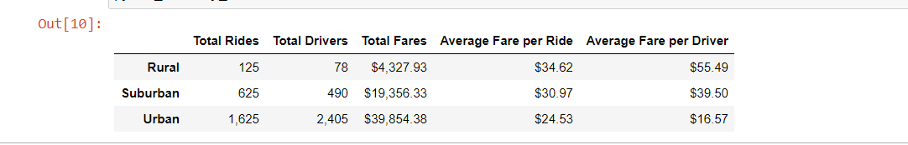

# PyBer_Analysis

## Overview of Analysis

This Analysis is about showing the total weekly fares by usinng   multiple-line graph in three city types  suburban ,urban and rural , On the other hand Analyzing total rides for each city type ,total drivers  and average fare per ride , we did also compared   the average ride fare to the total number of rides  
This data is  including set of information  in Total Rides	,Total Drivers ,	Total Fares	Average Fare per Ride and 	Average Fare per Driver

## Results

               
               
  
  
  

the multiple-line chart shows  there is a relationship between city population and the total number of rides and total drivers , we can notice the average fare per ride and per driver seems to increase in urban areas and suburban areas ,another fact  in rural areas Less drivers   lead to a higher average fare per ride  
it is related to  the accessiblity for (the internet connection ) and the public transportion on that areas  

the multiple line chart is able to show  total fare by city over jan to may 5 months we cab see a increase during the month of Apriland  The number of rides seem not stable  at the end of February and fluctuates during the month of March  the peek is at the end of feb 

## Summary
first of all We can see an  increase during the month of April in suburban cities, and  the total fare decreases for other types of cities
secondable the average fare per ride shows an increase from more populated cites to less populated cities.
these information helps the  company addressing the reasons behind these data and fixing it  by limiting or increasing the number of drivers during a certain time . and we can notice the less rides is the reason behing less drivers and making average fare per ride more expensive the  data set is so important in making the company making more profit and managing the rush hours in hiring new drivers and also addressing the problem why in rural areas
total rides are minumum 

