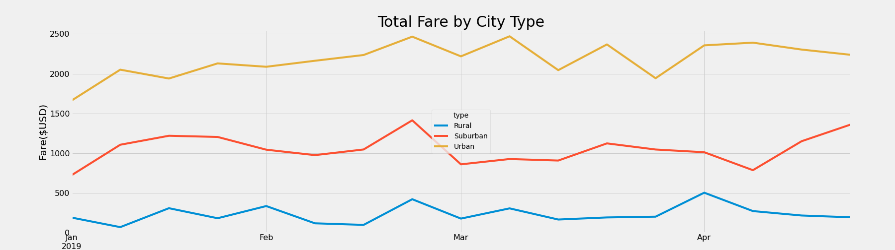

# PyBer_Analysis

## Overview of Analysis

This Analysis is about showing the total weekly fares by usinng   multiple-line graph in three city types  suburban ,urban and rural , On the other hand Analyzing total rides for each city type ,total drivers  and average fare per ride for each city type, we did also compared   the average ride fare to the total number of rides  
This data is  including set of in formation  in Total Rides	,Total Drivers ,	Total Fares	Average Fare per Ride and 	Average Fare per Driver

## Results

We can tell there is a relationship between city population and the total number of rides and total drivers , we can notice the average fare per ride and per driver seems to increase in urban areas and suburban areas ,another fact  in rural areas Less drivers   lead to a higher average fare per ride and driver 
it is related to  the accessiblity for (the internet connection ) and the public transportion on that areas  

